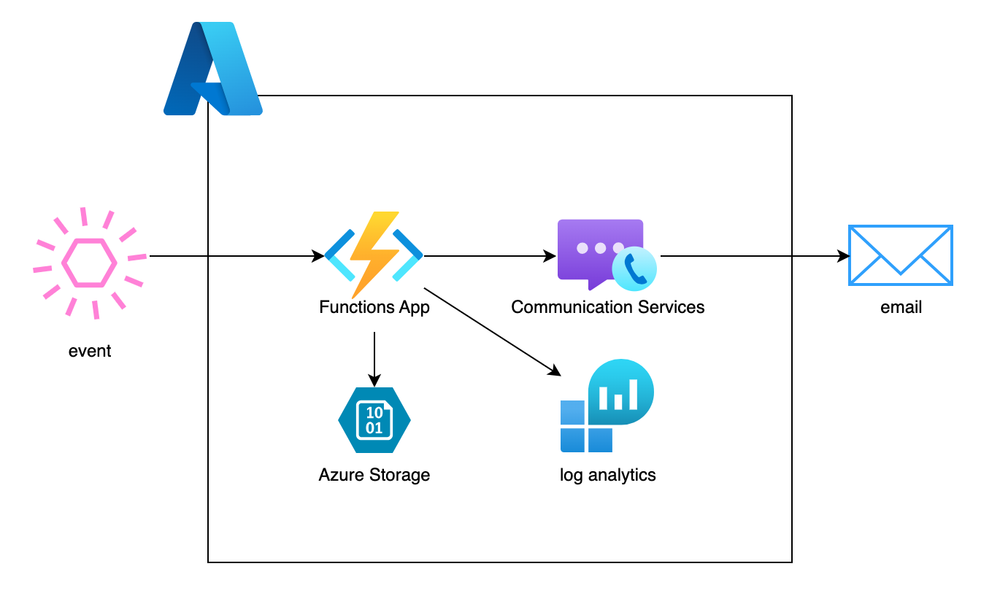
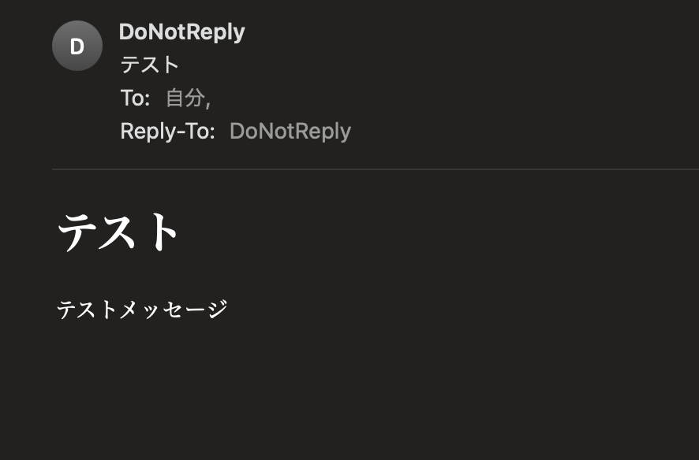

# Azure Functions & Communication Services を用いたイベント駆動アーキテクチャの構築


<p align="center">
  
</p>


[](https://www.python.org/)


## システム概要

本システムは、Azure Functionsと Azure Communication Servicesを活用したイベント駆動型アプリケーションです。特定のイベントをトリガーとして、自動的に通知メールを送信する機能を提供します。

### 主な機能

- **イベントトリガー処理**: HTTP リクエストを受け取り、イベントとして処理
- **自動メール通知**: イベント発生時に指定された宛先へメール通知
- **ログ管理**: システム内で発生するイベントのログ収集・分析
- **インフラストラクチャのコード化**: Terraform を用いたIaCアプローチによる環境構築

### 技術スタック

- **プログラミング言語**: Python 3.12
- **クラウドサービス**: Microsoft Azure
- **サーバーレス環境**: Azure Functions
- **通知サービス**: Azure Communication Services
- **ログ分析**: Azure Monitor & Log Analytics
- **ストレージ**: Azure Storage Account
- **インフラ構成管理**: Terraform
- **開発環境**: Docker Compose

## イベント駆動アーキテクチャ

このアーキテクチャ構成では、特定のイベントの発生を契機として処理が実行されます。

- **トリガー**: イベントの発火には、Azure Functions をホストする Function App が使用されます。
- **通知**: イベントに応じた通知処理として、Azure Communication Services を使用した電子メール送信が行われます。
- **ログ収集**: 発生したログは Azure Monitor の Log Analytics ワークスペースにおいて集約および分析されます。
- **データ保存**: ログデータやその他の関連データは、Azure Storage アカウント（Terraform における azurerm_storage_account リソース）に保存されます。
- **デプロイ**: Azure Functions へのソースコードのデプロイは、ZIP 形式のアーカイブファイルを使用して実施されます。


## Azure Function アプリケーションデプロイ手順

### 1. 依存関係パッケージの生成

Docker Compose を使用して必要な Python 依存関係パッケージを生成します：

```bash
docker compose up
```

これにより、`apserver/output/azure` ディレクトリに依存性パッケージが生成されます。

### 2. 依存関係の配置

生成された依存関係パッケージを Terraform インフラストラクチャディレクトリに配置します：

```bash
# 必要なディレクトリ構造を作成
mkdir -p infra/modules/function_app/src/in/.python_packages/lib/site-packages

# 依存関係をコピー
cp -r apserver/output/azure/* infra/modules/function_app/src/in/.python_packages/lib/site-packages/
```

### 3. Azure へのデプロイ

Azure にログインし、Terraform を使用してインフラストラクチャをデプロイします：

```bash
# Azure にログイン
az login

# Terraform を使用してデプロイ
bin/terraform_apply
```

### 4. Email ドメインの検証と設定

デプロイ後、Azure Communication Services でメール送信を有効にするためにドメインを設定します：

1. [Azure Portal](https://portal.azure.com) にログイン
2. `notification-communication-service` (Azure Communication Services) リソースに移動
3. 左側のメニューから「Email Services」>「Domains」を選択
4. 「+ Add domain」をクリック
5. 使用するドメイン情報を入力
6. Azure が提供する DNS レコード情報をコピー
7. ドメインレジストラーの DNS 設定で、以下のレコードを追加：
   - TXT レコード
   - MX レコード
   - SPF レコード
   - DMARC レコード（推奨）
8. Azure Portal に戻り、「Verify」をクリック
9. 検証が完了したら、ドメインを Communication Services にリンク

### 5. 通知機能のテスト

Function App がデプロイされたら、エンドポイントに POST リクエストを送信してテストします：

```bash
curl -X POST https://your-function-app.azurewebsites.net/api/notification \
  -H "Content-Type: application/json" \
  -d '{
    "to_email": "your_address@test.com",
    "subject": "テスト",
    "message": "テストメッセージ"
  }'
```

または Azure Portal の Function App テスト機能を使用して、以下の JSON をリクエストボディとして送信：

```json
{
  "to_email": "your_address@test.com",
  "subject": "テスト",
  "message": "テストメッセージ"
}
```

以下のメールが届けば、成功しています。

<p align="center">
  
</p>
